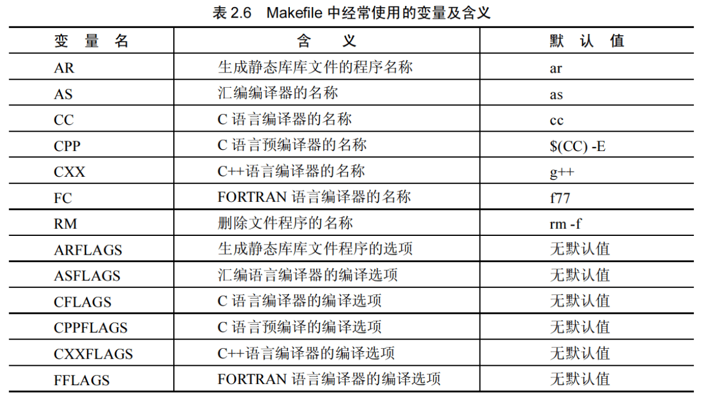
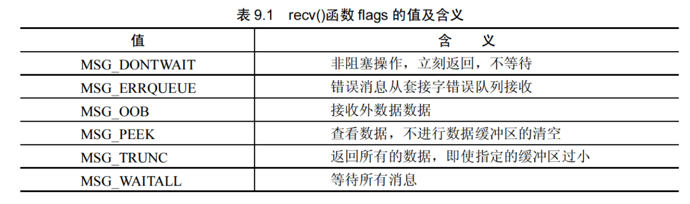

# Linux网络编程

## 1.Linux操作系统概述
### 1.5 进程调度SCHED
Linux进程调度方式有三种：

1. SCHED_OTHER ,普通进程的时间片轮转调度策略，每个进程的时间片用完之后，会从优先级队列里面选择优先级高的进程中选择进程执行
2. SCHED_FIFO ,按照进入队列的先后顺序进行调度。
3. SCHED_RR , 和SCHED_OTHER的策略类似，只是进程的优先级要高，每个进程的时间片用完之后将进程放入队尾

Linux 内进程的通讯方式主要有如下几种：管道方式，信号方式，消息队列方式，共享内存和套接字等方法
### 1.6 Linux文件系统结构

## 2. Linux环境编程

### 2.1 Vim编辑器
两种模式：默认模式，插入模式

vim打开文件后进入默认模式，按`i`进入插入模式，`a`表示插入模式的追加

#### 2.1.1 常用指令

1. 光标移动：h($\leftarrow$)，j ($\downarrow$) ，k ($\uparrow$) ，l ($\rightarrow$)
2. 删除字符：x
3. 删除整行：dd
4. 恢复删除：u
5. 撤销之前的一条命令：Ctrl+r
6. 复制：y
7. 复制单词：yw
8. 复制指定数量的单词：y*w (\*为单词数量)
9. 粘贴：p
10. 字符查找：`/xxx`,按N跳转到下一个匹配处
11. 跳到某一行：`:n` 或者 `nG`
12. 设置缩进：`set cindent shiftwidth=4`
13. 设置tab键的空格数量：`set tabstop=n`
14. 设置行号：`set number`

### 2.2 编译工具

程序代码编译过程分为如下四步：
```
---------     ------------     --------    --------
| 预编译 | --> | 编译和优化 | --> | 汇编 | --> | 连接 |
---------     ------------     --------    --------
```

预编译：将头文件包含进源代码中，做一些宏替换

编译过程：将代码翻译成汇编语言，生成目标文件

链接：将所有目标文件通过连接组合起来，形成可执行文件

使用gcc编译工具会自动完成这三步，也可以分开

```shell
生成指定名称的可执行文件：gcc xxx.c -o xxx
```
#### 2.2.1 生成目标文件
同时也可以使用如下指令身成目标文件，一般情况下目标文件与源文件同名，只是后缀为`.o`，也可以用`-o`参数指定生成的文件名

```shell
生成目标文件:gcc -c xxx.c
生成指定的目标文件：gcc -c -o xxx.o xxx.c
```
gcc 也支持一条命令编译多个源文件，生成目标文件
```
gcc -c xxx1.c xxx2.c xxx3.c
```

#### 2.2.2 预处理
gcc可以通过指定参数进行预处理操作，通过如下指令可以生成预处理后的结果。同时生成`.i`预处理文件
```shell
gcc -E xxx.c
```

我们对`src/main.cpp`执行`gcc -E src/main.cpp `后可以看到如下结果：

```c
# 0 "src/main.cpp"
# 0 "<built-in>"
# 0 "<command-line>"
# 1 "/usr/include/stdc-predef.h" 1 3 4
# 0 "<command-line>" 2
# 1 "src/main.cpp"
# 1 "src/event_test/select_event_test.h" 1
extern int select_event_test(int argc,char * argv[]);
# 2 "src/main.cpp" 2
# 1 "src/socketopt/socketopt_test.h" 1
extern void get_eth_info(int argc,char * argv[]);
# 3 "src/main.cpp" 2

int main(int argc,char * argv[]){

    get_eth_info(argc,argv);
    return 0;
}
```

可以看到gcc将头文件的代码包含进源文件中。同时也会对定义的宏进行替换

#### 2.2.3 编译成汇编

通过如下命令编译成汇编代码，会生成`.s`的汇编文件
```shell
gcc -S xxx.c
```

我们对`src/main.cpp`执行该命令后会在目录下看到`main.s`文件:
```
	.file	"main.cpp"
	.text
	.globl	main
	.type	main, @function
main:
.LFB0:
	movq	%rsp, %rbp
	.cfi_def_cfa_register 6
	subq	$16, %rsp
```

#### 2.2.4 生成和使用静态链接库

对于大项目来说，涉及到多人协同开发，个人可以设计自己的函数，通过静态链接库或者动态链接库的方式提供给别人进行三方代码的连接。

##### 2.2.4.1 生成静态链接库

使用`ar`命令可以将目标文件打包成静态连接文件。使用命令如下：
```shell
ar -rcs libxxx.a xxx.o
```
该命令将`xxx.o`文件打包成`libxxx.a`

##### 2.2.4.2 使用静态链接库

在生成可执行文件的时候，在指令后面添加静态链接库的包,也可以使用`-l`指定链接库
```shell
gcc -o main main.c libxxx.a
gcc -o main main.c -lxxx
```
其中`-l` 会从系统目录中去搜索该函数库，如果该文件不在系统目录中可能会找不到该文件，因此可以通过`-L`进行路径指定

```shell
gcc -o main main.c -L./ -lxxx
```
#### 2.2.5 生成和使用动态链接库

动态链接库是目标文件的集合，其中的代码地址都是相对路径，真实路径在加载的时候生成。动态链接库的真名由固定的格式组成：libxxx.so.x，lib前缀+库名称+.so+小版本号

该真名同时会用一个软链接链接生成一个别名(libxxx.so)的链接库

##### 2.2.5.1 生成动态链接库

使用gcc生成动态链接库
```shell
gcc -shared -Wl,-soname,libxxx.so -o libxxx.so.x xxx.c
```
使用`-shared` 表示生成一个动态链接库

`-soname,libxxx.so` 表示生成一个别名为`libxxx.so`

`-o libxxx.so.x` 表示生成实际名称为`libxxx.so.x`

`-fPIC/-fpic` 该编译选项表示生成和位置无关的库

##### 2.2.5.2 使用动态生成库

1. 动态链接库的使用方法与静态链接库的使用方法相同。可以通过`-l , -L`命令来使用和指定库的路径

2. 动态链接库需要将库放入系统搜索的路径中例如`/usr/lib,/lib`中，或者将动态链接库的路径加入系统环境变量中（见shell）,也可以更改系统默认的链接库搜索路径,系统的动态链接库搜索路径可以查看`/etc/ld.so.conf`文件
   
```shell
export $LD_LIBRARY_PATH=$LD_LIBRARY_PATH:/self_path
```
3. 可以使用`/lib/ld-linux.so.2 --library-path libxxx.so program` 命令进行库的加载

4. 如果同时存在同名的静态库和动态库的时候，默认会加载动态库，可以通过`-static`指定加载静态库

##### 2.2.5.3 动态链接库管理命令
`ldconfig` 用于动态链接库的管理，该命令会重新扫描和重建所有动态链接库的路径。

当安装新的三方库或者创建自己的动态链接库后，为了更新系统的动态链接库缓存列表可以使用该命令进行更新。

更新后的动态链接库会写入`/etc/ld.so.cache`文件中

常用命令：

1. `ldconfig -p` 查看所有动态链接库和其路径
2. `ldconfig -v` 扫描并打印动态链接库
3. `ldconfig /path` 扫描指定路径，将结果加入缓存中


#### 2.2.6 动态加载库
动态加载库用于在函数中执行过程中找到库函数，进行调用

主要相关函数有：`dlopen(),dlerror(),dlsym(),dlclose()`

##### 2.2.6.1 打开动态库函数`dlopen()`

`dlopen(const char * path,int flag)` 该函数有两个参数，第一个是库路径，第二个是打开方式，一般使用`RTLD_LASY`,该函数返回该库的指针

##### 2.2.6.2 获取函数指针`dlsym()`

`dlsym(void * handle,char * symbol)` 第一个参数是打开库后的文件句柄，第二个是函数名，该函数返回函数指针

##### 2.2.6.3 动态加载库的流程

```
----------	   ---------	 -----------
| dlopen | --> | dlsym | --> | dlclose |
----------	   ---------	 -----------
```

### 2.3 Makefile
Makefile 文件的编写 本质上是命令行的组合，主要思路就是通过`GCC`或者`G++`进行目标文件的生成，然后通过链接最后身成可执行程序。

该文件的编写语法主要是：
```makefile
生成目标：依赖条件
	生成目标的具体指令1
	生成目标的具体指令2
```

例如对于如下代码结构：

1. `add/add_float.cpp,add/add_int.cpp`提供单精度和整型加法
2. `sub/sub_float.cpp,sub/sub_int.cpp` 提供单精度和整形减法
3. `main.cpp`对加法和减法进行调用

按照传统命令的写法得先编译生成加减法的目标文件，最后通过这五个目标文件链接生成可执行文件

```shell
gcc -c -o add_float.o add_int.o add_float.cpp add_int.cpp
gcc -c -o sub_float.o sub_int.o sub_float.cpp sub_int.cpp
gcc -c -o main.o main.cpp add_float.h add_int.h sub_float.h sub_int.h
gcc -o main main.o add_float.o add_int.o sub_float.o sub_int.o
```

该编译命令可以直接通过`makefile`语法进行整合

```makefile
main:main.o add_float.o add_int.o sub_float.o sub_int.o
	gcc -o main main.o add_float.o add_int.o sub_float.o sub_int.o
main.o:main.cpp add_float.h add_int.h sub_float.h sub_int.h
	gcc -c -o main.o main.cpp add_float.h add_int.h sub_float.h sub_int.h
add_float.o:add_float.cpp
	gcc -c -o add_float.o add_float.cpp
add_int.o:add_int.cpp
	gcc -c -o add_int.o add_int.cpp
sub_float.o:sub_float.cpp
	gcc -c -o sub_float.o sub_float.cpp
sub_int.o:sub_int.cpp
	gcc -c -o sub_int.o sub_int.cpp
	
clean:
	rm -f ./*
```

可以看到第一行生成`main`需要后面的`main.o add_float.o add_int.o sub_float.o sub_int.o`这些文件

而后面的每个文件和下面的指令一一对应都可以找到对应的生成命令和生成条件

因此可以通过这种嵌套的方式，逐级递进找到生成关系进行生成。

每个规则目标都可以对应多个生成指令，例如进入目录`cd`，创建目录`mkdir`，文件流函数`sed`等

`makefile`的生成规则，在调用`make`指令后会默认执行第一条的生成规则，也可以通过`make xxx`来指定执行的生成规则，例如`make clean`，则会执行清除操作

##### 2.3.1 模式匹配

使用`%o:%c`可以将目标域的`.o`文件替换成`.c`

`$<`表示依赖项名称

`$@`表示目标域名称

因此如下代码可以做如下简化

```makefile
sub_int.o:sub_int.cpp
	gcc -c -o sub_int.o sub_int.cpp
	
sub_int.o:%o:%c
	gcc -c $< -o $@
```

##### 2.3.2 自定义变量

```makefile
OBJ = xxx # 定义变量
OBJ_2 = $(OBJ) # 使用变量
```
##### 2.3.3 预定义变量


##### 2.3.4 自动变量


主要分成两类：目标文件和依赖文件

1. 目标文件：
   1. `$*` 目标文件的名称，不包含拓展名部分
   2. `$@` 目标项中的目标文件名称
2. 依赖文件
   1. `$+` 表示所有的依赖文件，这些依赖文件之间以空格分开，可能有重复的依赖文件
   2. `$<` 依赖项中的第一个依赖文件名称
   3. `$?` 依赖项中，所有目标文件时间戳晚的依赖文件
   4. `$^` 依赖项中，所有不重复的依赖文件名称

参考makefile文件执行make后可以看到如下命令输出：
```makefile

OBJ = src/cal.o src/add/add_float.o src/add/add_int.o src/sub/sub_float.o src/sub/sub_int.o 
TARGET = cal
INCLUDE = -Iadd_int -Iadd_float -Isub_int -Isub_float
$(TARGET):$(OBJ)
	g++ $^ -o $@ $(INCLUDE)
	
$(OBJ):%o:%cpp
	g++ $< -c -o $@ $(INCLUDE)
clean:
	-$(RM) -f $(OBJ)
	-$(RM) -f $(TARGET)
```
```shell
g++ src/cal.cpp -c -Iadd_int -Iadd_float -Isub_int -Isub_float -o src/cal.o 
g++ src/add/add_float.cpp -c -Iadd_int -Iadd_float -Isub_int -Isub_float -o src/add/add_float.o 
g++ src/add/add_int.cpp -c -Iadd_int -Iadd_float -Isub_int -Isub_float -o src/add/add_int.o 
g++ src/sub/sub_float.cpp -c -Iadd_int -Iadd_float -Isub_int -Isub_float -o src/sub/sub_float.o 
g++ src/sub/sub_int.cpp -c -Iadd_int -Iadd_float -Isub_int -Isub_float -o src/sub/sub_int.o 
g++ src/cal.o src/add/add_float.o src/add/add_int.o src/sub/sub_float.o src/sub/sub_int.o -o cal -Iadd_int -Iadd_float -Isub_int -Isub_float
```

前五行将所需的目标文件展开进行循环生成。因此`%o:%c`将`.o`文件替换成`.c`文件名后，下面的命令同时也进行了展开，所以`	g++ $< -c -o $@ $(INCLUDE)` 这行和`	g++ $^ -c -o $@ $(INCLUDE)`等价

##### 2.3.4 路径搜索

将指定待搜索的路径添加到`VPATH`变量中，并使用冒号分隔，`make`会自动找到文件对应的路径添加到文件前。

##### 2.3.5 自动推导规则

`makefile`里面存在一套自动的推导规则：对于生成`.o`文件会自动推导出其关联的`.c`文件，并进行生成。

因此在`makefile`里可以省略`.c`和`.o`的生成关系，我们只需要注意`.h`文件的关联关系

因此对于上诉的编译规则,可以在`makefile`里去掉这两行，同样能够成功编译
```makefile
$(OBJ):%o:%cpp
	g++ $< -c -o $@ $(INCLUDE)
```

##### 2.3.6 递归调用
除了通过`cd xxx && make` 进行下一级的编译以外还能通过 `make -C xxx` 进行下一级的编译

调用`make -C` 的`makefile` 叫做总控`makefile`,总控文件可以通过`export` 将变量传递给下一层的`makefile`。子层只需要以使用变量的方式进行使用即可

##### 2.3.7 函数

1. 获取模式匹配的文件名函数`$(wildcard PATTERN)`，通过正则匹配查找符合的文件名
2. 模式替换函数`$(patsubst pattern,replacement,text)`，将`text`中符合`pattern`的内容替换成`replacement`
3. 循环函数`$(foreach var,list,text)`,将`list`中以空格分隔的字符赋值给`var`并执行`text`命令

### 2.4 GDB调试

## 3.文件系统

### 3.1 通用文件操作方法

文件描述符用于关联文件和内核驱动的数据结构，以及内核中的特异性的接口。
我们通过文件描述符可以对文件或者设备进行数据读取或者数据写入等操作

#### 3.1.1 open和create函数
用于创建或者打开文件

```c
#include <sys/types.h>
#include <sys/stat.h>
#include <sys/fcntl.h>
// 以指定的模式打开文件
int open(const char * pathname,int flags);
int open(const char * pathname,int flags,mode_t mode);
```
`open()`函数使用`flags`的指定模式打开文件，打开文件成功时会返回一个整型文件描述符

`flags`有如下几个标识：
1. `O_RDONLY` 只读
2. `O_WRONLY` 只写
3. `O_RDWR` 读写
4. `O_APPEND` 追加
5. `O_CREAT` 如果文件不存在进行创建，存在则会打开，一般会随着第三个参数给定文件的权限
6. `O_EXCL` 查看文件是否存在,如果存在则会报错。
7. `O_TRUNC` 将文件截断为0
8. `O_NONBLOCK` 非阻塞方式打开文件

可以组合上诉几个标识同时使用，例如`O_CREATE | O_RDWR`,创建一个文件并以可读可写的模式打开。

`O_CREATE | O_EXCL` 判断该文件是否存在并创建。该文件存在则会报错返回`-1`文件描述符

`mode`值为5位，每位以`7421`进行取值，`7(111)`表示可读可写可执行的权限，`4(100)`表示读权限，`2(010)`表示写权限，`1(001)`表示执行权限

`mode`的前两位保留位为`0`，后三位从左至右分别表示，所属用户(u)，所属组(g)，其他用户(o)

可以通过求于进行组合各种权限，例如让所属用户，所属组，其他用户都具有可读可写可执行的权限可以进行如下计算：`00700 | 00070 | 00007 = 00777`

`create()`函数等效于`open(filename,O_CREATE | O_TRUNC | O_RDWR, mode)`

#### 3.1.2 close函数
`close`函数本身用于释放文件描述符，

```c
#include<unistd.h>
// 成功返回0,失败返回-1
int close(int id);
```
#### 3.1.3 read函数
该函数的作用是从文件描述符所指向的文件或设备中读取指定字节的数据。

该函数返回值为实际读取的字节数。发生错误时返回-1.

```c
#include<unistd.h>
ssize_t read(int fd,void * buf,size_t count);
```

#### 3.1.4 write函数
该函数的作用是将缓存区内的数据写入文件描述符所指向的文件或者设备

该函数返回实际写入的字节数，发生错误时返回-1.
```c
#include<unistd.h>
ssize_t write(int fd,const void * buf,size_t count);
```

**标准输入输出分别对应文件描述符为`0`和`1`。可以通过`read,write`函数直接读写。**

#### 3.1.5 lseek函数
该函数的作用是将文件开始读取的位置进行偏移指定的字节数

该函数执行成功返回文件的偏移值，如果失败返回-1.**注意：文件偏移值可以为负数，因此要利用-1来判断是否失败**
```c
#include<sys/types.h>
#include<unistd.h>
off_t lseek(int fd,off_t offset,int whence)
```

`whence` 有如下三个值：
1. `SEEK_SET` 配合`offset`表示从文件开头进行相对偏移
2. `SEEK_CUR` 配合`offset`表示从当前读取位置进行偏移
3. `SEEK_END` 配合`offset`表示从文件结尾进行相对偏移

#### 3.1.6 fstat函数
该方法用户获取文件的状态，例如文件的所属人，所属组，文件大小等信息

函数执行成功时返回0,同时文件的属性信息通过buf指针注入结构体,失败时返回-1.
```c
#include<sys/types.h>
#include<sys/stat.h>
#include<unistd.h>
int stat(const char * path,struct stat * buf);
int fstat(int fd,struct stat * buf);
int lstat(const char * path,struct stat * buf);
```

#### 3.1.7 mmap函数
该函数用于将设备或者文件的空间映射到内存中，常见使用在`v4l2`中将屏幕抓取到的帧信息映射到用户空间中，然后进行读取处理。

该函数如果执行成功返回内存地址。如果失败返回-1.
```c
#include<sys/mman.h>
// 将文件描述符fd所指向的设备和文件，自offset后一段长度为length的空间，映射到start指定的内存空间
void * mmap(void * start,size_t length,int prot, int flags,int fd,off_t offset);
```

1. `start`:为指定的地址空间，可以为`NULL`
2. `length`：指定设备或者文件需要映射空间的长度
3. `prot`:映射区的保护方式,该值可以由一个或者多个值进行组合。该标识符同时也受文件或者设备打开方式的限制。
   1. `PROT_EXEC`:可执行
   2. `PROT_READ`:表示区域可读取
   3. `PROT_WRITE`:表示区域可写入
   4. `PROT_NONE`:表示区域不能存取
4. `flags`:表示映射对象的类型，该值同样是一个组合值
   1. `MAP_FIXED`:配合`start`使用，映射到固定地址
   2. `MAP_SHARED`:共享的映射区域，该区域可以被其他进程共享
   3. `MAP_PRIVATE`:对映射区域写入时，会产生一个映射文件的复制。读不受影响
   4. `MAP_ANONYMOUS`:匿名映射，映射区域不受为文件描述符的影响，且不会被其他进程共享
   5. `MAP_DENYWRITE`:对文件的写入禁止，并且不允许对文件直接操作，只允许通过该映射区域对文件经行操作
   6. `MAP_LOCKED`:映射区域锁定，不会被虚拟内存重置 
5. `fd`:设备文件描述符
6. `offset`：偏移量

#### 3.1.8 munmap函数
与`mmap`函数对应，`munmap`函数取消内存映射关系

```c
#include<sys/mman.h>
int munmap(void * start,size_t length)
```
这里`start`为`mmap`创建成功的返回值，`length`为该区域的大小

#### 3.1.9 文件属性函数fcntl
该函数(file control)用于获取或者改变文件的属性，即可以向文件发送命令，该函数的返回值依赖于命令。

```c
#include<unistd.h>
#include<fcntl.h>
int fcntl(int fd ,int cmd)
int fcntl(int fd ,int cmd,long arg)
int fcntl(int fd ,int cmd,struct flock * lock)
```

通过发送指定的命令我们可以获取相关的信息，例如发送:`F_DUPFD` 可以复制并获取一个新的文件描述符，`F_GETFD`可以获取文件状态，是只读，只写或者是可读写等


#### 3.1.10 文件输入输出控制函数ioctl

该函数(io control)通过对设备发送指令来控制设备

同样我们也可以自定义一个设备，通过自定义的命令进行相关的操作。该函数也会起到相应的作用

函数成功执行会返回0或者大于1的值，失败返回-1.
```c
#include<sys/ioctl.h>
int ioctl(int d,int request,...)
```

一般而言对于设备的操作我们都通过`ioctl`函数来进行操控，例如：使`CDROM`弹仓等


## 4.进程和线程

进程通讯的三种方式：
1. 管道通讯(FIFO)，一个进程负责写，一个进程负责读。来传递消息
2. 共享内存，使用一块内存地址，能够被多个进程访问
3. 消息队列，按照一定的格式将消息挂载到消息队列上，对于需要读取的进程将其读出。

进程同步的两种方式：
1. 消息队列
2. 信号量

### 4.1 进程创建方式

#### 4.1.1 获取进程号
`getpid`获取进程号，`getppid`获取父进程号

```c
#include<sys/types.h>
#include<unistd.h>
pid_t getpid(void);
pid_t getppid(void);
```

#### 4.1.2 进程复制
`fork`函数用于以父进程复制一个进程，在`linux`中该函数是写复制，只有当子进程或者父进程修改之后才重新生成一份


并且该函数会返回两次，分别在父进程里返回一次，子进程里也返回一次。

父进程中该函数成功时返回进程ID，失败时返回-1.子进程里操作成功返回0

```c
#include<sys/types.h>
#include<unistd.h>
pid_t fork(void);
```
#### 4.1.3 系统调用方式

使用`system`函数进行系统调用，可以运行`linux`命令

```c
#include<stdlib.h>
int system(const char * command)
```

或者使用`exec`系列函数
```c
#include<unistd.h>
int execve(const char * path,char * const argv[])
```

### 4.2 进程之间的通讯

#### 4.2.1 半双工管道
顾名思义，一个管道只负责读，一个管道只负责写。因此对以每个进程而言都需要创建两个管道。并且设置好数据流的方向

用于创建管道的函数是`pipe`。 见样例[pipe_test.cpp](./src/pipe_connect/pipe_test.cpp)

```c
#include<unistd.h>
int pipe(int filedes[2])
```
该函数创建两个文件描述符保存在`filedes`中，该数组中`filedes[0]`用作读，`filedes[1]`用作写，执行成功返回0,失败时返回-1.

注：管道操作的阻塞性，如果一次性写入的字节数大于管道的限制`128K`，程序则会阻塞，等待消费端进行消费。

#### 4.2.2 命名管道

使用`mkfifo`来创建命令管道(FIFO)
```c
#include<sys/types.h>
#include<sys/stat.h>
int mkfifo(const char * pathname,mode_t mode)
```

该管道默认阻塞。当一个管道使用读打开时，会一直等待一个进程写入。反之同样。可以设置`O_NONBLOCK`来取消阻塞


#### 4.2.3 消息队列

消息队列是`linux`内核中的链表，可以通过该链表在进程之间传递消息。每个消息队列通过`IPC`的标识符唯一区别。

##### 4.2.3.1 键值构建函数

file to key 函数用于将一个文件和项目名生成一个系统V的IPC键值`key`，通过该唯一值可以用于生成消息队列。在生成消息队列后可以通过消息队列的`id`来发送消息或者接受消息。
```c
#include<sys/ipc.h>
#include<sys/types.h>
key_t ftok(const char * pathname,int proj_id)
```

#### 4.2.4 信号量
信号量是一种计数器，用来统计一个资源的访问数。

##### 4.2.4.1 创建信号量

```c
#include<sys/types.h>
#include<sys/ipc.h>
#include<sys/sem.h>
int semget(key_t key,int nsems,int semflg)
```

该函数中`key`是`ftok`生成的键值，`nsems`是创建信号量的数目，`semflg`是打开信号量的方式。该方式有如下几种：
1. `IPC_CREATE`，不存在则创建
2. `IPC_EXCL`, 如果信号量存在，则操作失败。

##### 4.2.4.2 信号量操作函数semop

等同于信号量的PV操作

```c
#include<sys/types.h>
#include<sys/ipc.h>
#include<sem.h>
int semop(int semid,struct sembuf * sops,unsigned nsops)
```

第一个参数`semid`由`semget`获得。

其中`sops`是信号量的操作集合,是一个数组，`nsops`是`struct sembuf`的数量，其结构如下：
```c
struct sembuf{
	ushort sem_num; // 信号量索引编号，标识第几个信号量
	short sem_op;	// 信号量操作（正，负，0）
	short sem_flg;	// 信号量操作标识
}
```

##### 4.2.4.3 信号量的控制

```c
#include<sys/types.h>
#include<sys/ipc.h>
#include<sem.h>
int semctl(int semid,int semnum, int cmd,...)
```
该函数类似`ioctl`，用于对信号量进行控制，第一个参数`semid`是`semget`获取到的信号量ID，第二个`semnum`则是信号量的索引编号。

#### 4.2.5 共享内存

共享内存直接在内存层面将信息共享给多进程。共享内存的方式直接将某段内存进行映射，多个进程可以共享同一块物理内存，只是地址不一样。

##### 4.2.5.1 创建共享内存

```c
#include<sys/ipc.h>
#include<sys/sem.h>
int shmget(key_t key,size_t size,int shmflg)
```
该函数用于创建一块指定大小`size`的共享内存段，`key`是`ftok`函数创建的键值，`shmflg`定义了该键值代表的共享内存的打开方式
1. `IPC_CREATE`:创建
2. `IPC_EXCL`:存在性判断

该函数调用失败会返回-1,成功会返回共享内存的ID

##### 4.2.5.2 获得共享内存地址函数
```c
#include<sys/ipc.h>
#include<sys/sem.h>
void * shmat(int shmid,const void * shmaddr,int shmflg)
```
share memory attach 函数

第一个参数，`shm_id`是由`shmget()`函数返回的共享内存标识。`shm_addr`指定共享内存连接到当前进程中的地址位置，通常为空，表示让系统来选择共享内存的地址。也可以指定地址
第三个参数，`shm_flg`是一组标志位，通常为0

调用成功时返回一个指向共享内存第一个字节的指针，如果调用失败返回-1.

##### 4.2.5.3 共享内存分离函数

share memory detach 该函数用于将该块共享内存和进程中映射的内存区域断开链接。使对当前进程不可见。
```c
#include<sys/ipc.h>
#include<sys/sem.h>
int shmdt(const void * shmaddr)
```
##### 4.2.5.4 共享内存控制函数

```c
#include<sys/ipc.h>
#include<sys/sem.h>
int shmctl(int shmid,int cmd,struct shmid_ds * buf)
```
对共享内存发送指令完成相应的操作


#### 4.2.5 信号
用于捕获`linux`底层的信号，例如中断信号(Ctrl+C)，进程暂停信号等

##### 4.2.5.1 信号捕获函数

```c
#include<signal.h>
typedef void (*sighandler_t)(int);
sighandler_t signal(int signum,sighandler_t handler);
```

`signal`函数有两个参数，第一个是信号值，第二个是处理函数。返回一个函数指针。处理函数需要一个整型参数，并且无返回值。

常用的信号值有：
1. `SIGINT`：用户按下`Ctrl+C`或者`DEL`后触发该信号
2. `SIGQUIT`:用户按下`Ctrl+C`后触发该信号
3. `SIGKILL`: 使用`kill`命令杀掉进程时会触发该信号
4. `SIGSTOP`：停止一个进程时也会触发该信号
5. `SIGTERM`:由`kill`发送默认终止信号

见[sampleSocket.cpp](./src/signal_test/sampleSocket.cpp)

##### 4.2.5.2 信号发送函数

除了操作按键等待系统自动发送信号外，也可以通过函数的方式进行信号发送

```c
#include<sys/types.h>
#include<signal.h>
int kill(pid_t pid,int sig)
int raise(int sig)
```

`kill`函数第一个值为进程的ID，当为`0`时表示群发，第二个值为信号值。表示向某个进程发送指定信号。`raise`表示在当前进程中自举一个信号`sig`

### 4.3 多线程

线程的创建需要链接指定的库文件`libpthread.a`或`libpthread.so`

#### 4.3.1 线程创建函数
```c
#include<pthread.h>
int pthread_create(pthread_t * thread,pthread_attr_t * attr,void * (*start_routine)(void * ),void * arg)
```
第一个参数`thread` 是线程的结构体,也叫线程标识符，第二个参数`attr`是该线程的属性，用于设置该线程的属性。第三个是线程执行的方法,注意该方法的形式，第三个参数指定函数的形式需要一个`void *`的返回值，以及一个`void *`的形参，第四个参数则是该方法的具体参数。

线程创建成功时返回0。

#### 4.3.2 线程的结束函数

`pthread_join`函数用于阻塞当前线程等待另一个线程的运行完成。
```c
extern int pthread_join __P((pthread_t __th,void ** __thread_return))
```
第一个参数为线程标识符。由`pthread_create`创建,第二个是线程的返回指针，可以用来指向该线程的返回结果。第二个参数一般是一个指向地址的地址。也就是指针的指针。

另一个结束函数就是`pthread_exit`
```c
extern void pthread_exit __P((void * __retval)) __attribute__ ((__noreturn__));
```
该函数中提供一个返回值，可以被`pthread_join`捕获

#### 4.3.3 线程属性的修改

线程属性在结构体`pthread_attr_t`中，其中包括了线程的调度优先级，运行栈大小，运行栈地址等。

如果要对线程的属性设置，需要遵循如下流程：
```c
---------------------	  -----------------------	  -----------------------	   ------------------
| pthread_attr_init | --> | pthread_attr_getxxx | --> | pthread_attr_setxxx | -- > | pthread_create |
---------------------	  -----------------------	  -----------------------	   ------------------
```

首先进行线程参数的初始化，同时通过获取各种要设置的属性的值，在此基础上进行修改，修改后调用创建函数去创建线程。

#### 4.3.4 线程之间的互斥

多线程之间如何进行同步操作，依赖线程之间的互斥函数。主要函数有：
1. 初始化`pthread_mutex_init`,
2. 互斥量的加锁函数`pthread_mutex_lock`,
3. 互斥量的预锁定函数`pthread_mutex_trylock`,
4. 互斥量的解锁函数`pthread_mutex_unlock`
5. 销毁函数`pthread_mutex_destroy`

该五个函数的原型如下：
##### 4.3.4.1 初始化函数
```c
#include<pthread.h>
int pthread_mutex_init(pthread_mutex_t * mutex,const pthread_mutexattr_t * mutexattr)
```

该函数用于初始化一个互斥量，该信号量的数据结构是`pthread_mutex_t`,第二个参数是该互斥量的属性

**互斥区能保证同一时刻只有一个线程在进行操作。**

互斥锁的代码可以参见：[pthread_mutex_test](./src/pthread_test/pthread_mutex_test.cpp)

#### 4.3.5 线程中的信号量

信号量表示一个公共资源的存量，只有当资源量大于0时该资源才能被访问。

信号量的函数主要有如下几个：
1. `sem_init`，信号量初始化函数
2. `sem_post`，信号量增加函数
3. `sem_wait`,信号量减少函数
4. `sem_trywait`,信号量尝试减少函数
5. `sem_destroy`，信号量销毁函数

##### 4.3.5.1 初始化函数
```c
#include<semaphore.h>
extern int sem_init __P((sem_t * __sem,int __pshared, unsigned int __value));
```

该函数用于初始化一个信号量，信号量的数据结构是`sem_t`，第二个参数为`0`时,表示只能在当前进程的多个线程间共享，不为`0`时表示可以在多个进程间共享。第三个参数则是初始化信号量的值。

##### 4.3.5.2 信号量增加函数
```c
#include<semaphore.h>
int sem_pose(sem_t * sem)
```
对信号量的值+1

##### 4.3.5.3 信号量减少函数
```c
#include<semaphore.h>
int sem_wait(sem_t * sem)
```
对信号量的值-1,如果当前信号量的值为`0`,则线程会一直阻塞，直到信号量的值大于`0`。

##### 4.3.5.4 信号量销毁函数
```c
#include<semaphore.h>
int sem_destroy(sem_t * sem)
```

信号量代码见：[semaphore_test.cpp](./src/pthread_test/semaphore_test.cpp)


## 5. TCP/IP协议

由于不同计算机的数据存储方式有大小端之分，小端：地址高位端存储数字的大端，大端：地址的低位端存储数字的大端部分。

下面是数值：0x12345678分别在大小端中的存储方式

```
		0	 1	  2    3	4
		---------------------
大端：	 | 12 | 34 | 56 | 78 |
		---------------------
		---------------------
小端：	 | 78 | 56 | 34 | 12 |
		---------------------
```

可见同样的值经过网络传输之后，在不同的存储计算机中是不一样的，因此为了规避不同机器中存储方式不一样导致的问题，提出了一种网络传输字节序的转换方法。

通过：`htons`,`ntohs`,`htonl`,`ntohl`等方法(h表示host, n表示network,s表示short,l表示long)。将本地数字转换成网络字节序，并通过网络传输，到达另一个机器上后，通过同样的方法再转换成适应本地存储方式的数值。确保最终结果是一致的。该套方法在头文件：`netinet/in.h`中定义

上诉四个方法可以分为两类：
1. `htons`,`htonl`：表示把主机数值转换成网络字节序，分别对应了`short`和`long`两种类型
2. `ntohs`,`ntohl`：表示把网络字节序转换成主机数值，分别对应了`short`和`long`两种类型

## 7.套接字编程

### 7.1 通用套接字数据结构
```c
#include <sys/socket.h>
typedef	unsigned short sa_family_t;
struct sockaddr{
	sa_family_t sa_family;  	/*协议族*/
	char		sa_data[14];	/*协议族数据*/
}
```
该结构是套接字地址的通用数据结构。一般是`16`字节。

### 7.2 实际使用的套接字数据结构
```c
#include <netinet/in.h>
struct sockaddr_in{
	u8				sin-len;			/*结构sockaddr_in的长度*/
	u8				sin_family;			/*协议族*/
	u16				sin_port;			/*16位端口号*/
	struct in_addr  sin_addr;			/*IP地址,32位*/
	char		    sin_zero[8];		/*未用*/
}

struct in_addr{
	u32 			s_addr;				/*32位IP地址，网络字节序*/
}
```
可以看到`sockaddr_in`与`sockaddr`的结构体长度一样，都是`16`字节，是一一对应的，这两个结构可以通过强制类型转换。

`sockaddr_in`中包含了更多细分的参数信息，例如:IP地址，端口号。所以一般可以通过该结构进行设置，然后强转成`sockaddr`，交由`bind`,`send`等函数。


### 7.3 TCP网络编程

#### 7.3.1 服务器端设计流程

服务器端设计网络编程

1. 初始化套接字`socket`，设置网路类型和协议类型
2. 套接字与端口绑定`bind`
3. 设置监听队列`listern`
4. 接受请求`accept`
5. 接受数据`recv`/`read`
6. 发送数据`send`/`write`
7. 关闭套接字`close`

#### 7.3.2 客户端设计流程

1. 建立套接字`socket`
2. 与服务器进行链接`connect`
3. 发送请求`write`/`send`
4. 接受数据`read`/`recv`
5. 关闭套接字`close`

这两套流程主要用到的函数如下：

#### 1.socket函数
```c
#include<sys/types.h>
#include<sys/socket.h>
int socket(int domain,int type,int protocol)
```

第一个参数是通讯协议，该值定义在`sys/socket.h`文件里有进行定义。主要使用的是：
1. `AF_INET`:IPv4协议
2. `AF_INET6`：IPv6协议
3. `PF_PACKET`:底层包协议
4. `AF_UNIX`：本地通讯

第二个参数设置套接字的通讯类型，例如TCP(`SOCK_STREAM`)或者UDP(`SOCK_DGRAM`),原始网络协议访问(`SOCK_RAW`)，第三个参数和第二个参数有关,通常用于指定通讯类型中的某一个特别的协议类型。但是一般一个通讯类型对应一个协议类型，所以一般为0。表示让内核自己选择。如果有多个通讯协议可以指定不一样的值。

#### 2.bind函数

```c
#include<sys/types.h>
#include<sys/socket.h>
int bind(int sockfd,const struct sockaddr * my_addr,socklen_t addrlen)
```
该函数用于将套接字绑定在一个本地地址和端口上，该套接字可以接受该地址和端口上的所有满足协议的数据包。

该函数返回0时表示成功，返回-1时表示绑定失败

#### 3.listen函数
监听函数用于初始化服务器端的监听队列。当同时有多个链接接入时，服务器会将链接放入队列中。

```c
#include<sys/socket.h>
int listen(int sockfd,int backlog)
```

第一个参数是套接字符，第二个参数是队列的大小，在链接接入后还未来得及被`accept`处理的链接会放入该队列中等待处理。

#### 4.accept函数

当链接到来时，会在队列中等待，直到服务器使用`accept`处理接受请求。

**`accept`函数返回新链接客户端的套接字，通过该套接字可以给客户端发送数据**

```c
#include<sys/types.h>
#include<sys/socket.h>
int accept(int sockfd,struct sockaddr * addr,socklen_t *addrlen)
```

第一个参数是服务器的套接字，第二个是**链接客户端**的地址，第三个是地址结构的长度

#### 5.connect函数
此函数用于客户端连接服务器使用，只需要指定`IP`地址和端口号。

```c
#include<sys/types.h>
#include<sys/socket.h>
int connect(int sockfd,struct sockaddr * addr,int addlen);
```

第一个参数为本地`socket`的套接字，第二个参数为服务器的`IP`地址，第三个为地址对象的大小。

样例见[socketopt_test.cpp](./src/socketopt/socketopt_test.cpp)

**注：设置客户端连接地址的时候，要注意使用本地转网路字节序。否则有可能导致地址错误。**

上述五个函数如果报错，错误会写入`errno.h:errno`，我们可以使用`strerror()`返回错误的描述字符。

#### 6.write 函数

见[3.1.4](#314-write函数)

#### 7.read 函数

见[3.1.3](#313-read函数)

#### 8.关闭套接字函数

使用完套接字后需要关闭。释放内核资源

```c
#include<sys/socket.h>
int shutdown(int s,int how);
int close(int __fd);
```

其中`shutdown`函数可以指定关闭的方式，
1. `SHUT_RD`：值为0,关闭读
2. `SHUT_WR`：值为1,关闭写
3. `SHUT_RDWR`:值为2,关闭读写，该状态同`close`函数

## 8.服务器和客户端的信息获取

### 8.1字节序

计算机字节序更具 地址高位存储数值高字节位还是低字节位分为了 小端字节序和大端字节序 见[TCP/IP](#5-tcpip协议) 因此对于字节的网络传输 提出了网络字节序，以及`long`和`short`基础类型的转换函数：
1. `htonl`:`long`类型本地转网络字节序,`ntohl`:`long`类型网络转本地字节序
2. `htons`:`short`类型本地转网络字节序,`ntohs`:`short`类型网络转本地字节序

### 8.2字符串IP地址和二进制IP地址的转换
地址转换函数都在如下的头文件里：

```c
#include<arpa/inet.h>
```

1. `inet_aton(const char * cp,struct in_addr * inp)`函数，用于将**点分十进制**地址转换成`in_addr`**地址结构体**。并返回
2. `inet_addr`：将**点分十进制**转换成网路字节序的**二进制**，返回`in_addr_t`结构体。注：对于`255.255.255.255`地址转换的结果和函数报错的返回结果相同都是`-1`。因此该函数不能用于对`255.255.255.255`的地址转换
3. `inet_network`:将**点分十进制字符串**转换成网络字节序的**二进制地址**，返回`in_addr_t`结构体。对于完整的点分十进制(`a.b.c.d`)该函数同`inet_addr`,对于非完整的点分十进制(`a.b.c`,`a.b`,`a`)，除了最后一位值以外，其他的值都会作为正常的地址进行解析，最后一位值会补充剩余的地址位数。
4. `inet_ntoa`:用于将一个`in_addr`**结构体**转换成点分**十进制字符串**，该函数返回一个字符串指针，该地址指向的地址为静态区域，注：确保该块地址内容已经拷贝或者使用。并且避免多线程使用
5. `inet_makeaddr`:将二进制的网络段和主机段地址合成一个二进制的地址`in_addr`
6. `inet_lnaof`:返回二进制地址的主机部分。输入输出都是`in_addr`
7. `inet_netof`:返回二进制地址的网络部分，输入输出都是`in_addr`

上述七个函数中主要分为两类，分别是二进制转字符和字符转二进制
1. 字符转二进制的函数有：`inet_aton`,`inet_addr`,`inet_network`,其中后两个函数转换成网络序。
2. 二进制转字符的函数有：`inet_ntoa`,
3. 二进制转二进制：`inet_makeaddr`,`inet_lnaof`,`inet_netof`

#### 8.2.1 协议无关的地址转换

可以根据协议进行地址转换，并且函数是安全的。
1. `int inet_pton(int af,const char * src,void * dst)`:将字符串地址`src`更具协议类型`af`转换成二进制`dst`,转换出错返回-1
2. `const char * inet_ntop(int af,const void * src,char * dst,socklen_t cnt)`:将二进制地址`src`更具协议`af`转换成字符串`dst`,如果转换出错则返回空指针。

### 8.3 主机IP和域名的转换（DNS）

主要是更具主机名或者主机IP请求DNS服务器获取主机信息

#### 8.3.1 根据名称获取主机信息
```c
#include<netdb.h>
struct hostent * gethostbyname(const char * name)
```
该函数更具主机域名`name`返回一个指向`hostent`的指针，如果发生错误则返回`NULL`,错误信息可以从`errno`中获取

```c
/* Description of data base entry for a single host.  */
struct hostent
{
  char *h_name;			/* Official name of host.  主机官方名称*/
  char **h_aliases;		/* Alias list.  别名列表*/
  int h_addrtype;		/* Host address type.  主机地址类型*/
  int h_length;			/* Length of address.  地址长度*/
  char **h_addr_list;		/* List of addresses from name server.  地址列表*/
#ifdef __USE_MISC
# define	h_addr	h_addr_list[0] /* Address, for backward compatibility.*/
#endif
};
```

在`hostent`结构体中，主机别名`h_aliases`和主机地址列表`h_addr_list`都是链表结构

#### 8.3.2 根据IP地址获取主机信息

```c
#include<netdb.h>
#include<sys/socket.h>
struct hostent * gethostbyaddr(const void * addr,int len,int type)
```

该函数的返回数据结构通上，传入的是`addr`的二进制地址结构。

注：`hostent*`指向的内存结构是不可重入的，因此在保证使用完毕之前不能再次进入，以免破坏数据。该块地址是公用的静态地址。

### 8.4 协议处理函数

该系列提供了一套协议值的查询函数，该函数主要查询`/etc/protocols`中列出来的所有协议。
```c
#include<netdb.h>
struct protoent * getprotoent(void); /*读取协议文件的一行，以结构体返回*/
struct protoent * getprotobyname(const char * name); /*根据名称查询协议*/
struct protoent * getprotobynumber(int proto); /*根据协议ID查询协议*/
void setprotoent(int stayopen); /*设置协议打开模式*/
void endprotoent(void); /*关闭协议文件*/
```

可以通过上述三个查询接口查询协议的信息，同时注意`setprotoent(1)`函数可以避免在每次查询后自动关闭协议文件。


## 9. 数据的IO和复用

### 9.1 IO函数

除了利用文件操作的读写函数对套接字进行操作外(`read,write`)。还能使用`recv,send,recvmsg,sendmsg,readv,writev`等IO函数进行处理

#### 9.1.1 recv函数
该函数原型如下：
```c
#include<sys/types.h>
#include<sys/socket.h>
ssize_t recv(int s,void * buf,size_t len,int flags)
```

该函数可以通过`flags`所指定的方法来从套接字中读取数据，写入`buf`中。`flags`有如下几个值：


1. `MSG_DONTWAIT`：该标志将单个IO设置使用非阻塞的方法读取数据，而不用设置套接字的非阻塞属性
2. `MSG_OOB`：可以接受带外数据
3. `MSG_PEEK`：查看可读取的数据
4. `MSG_TRUNC`：截取数据，只保留缓存区大小的数据。
5. `MSG_WAITALL`:等待并读取缓存区大小的数据。

该函数的返回值是读取的数据大小。

面对有连接协议TCP，我们一般使用`recv`来读取数据，面对无连接的协议`UDP`一般使用`recvfrom`，在`recvfrom`中可以获取对端的地址。同时也可以将套接字绑定一个地址，使用`recv`函数来获取UDP的数据包

`recv`函数每次都会读取指定大小`len`长度的数据到缓存区，如果到来的数据大于缓存区长度，则也会读取一部分(`len`大小)，剩余的等待下次读取。同时会销毁内核中已经读取的数据。

如果内核的数据比缓存区小的化，在未设置`WAITALL`标志时，会将内核所有数据复制到缓存区，并返回复制数据的大小。

#### 9.1.2 send函数

```c
#include<sys/types.h>
#include<sys/socket.h>
ssize_t send(int s,const void *buf,size_t len,int flags)
```
同样，该函数相比较与`write`函数，可以指定写入的方式`flags`，该`flags`的值同`recv`,其他过程都类似。当`flags=0`时该函数和`write`函数完全一致。

**注：在发送结束和接受结束后一定要注意统计发送和接受的字节数**

#### 9.1.3 readv函数
从向量中读取数据，这里向量是多个缓存区的意思。

```c
#include<sys/uio.h>
ssize_t readv(int s,const struct iovec * vector ,int count)
```
从套接字中读取`count`块的数据到`vector`中。该块的数据结构如下：
```c
struct iovec{
	void *	iov_base;
	size_t  iov_len;
}
```
该数据结构中一定要指明`iov_base`的长度`iov_len`

#### 9.1.3 writev函数
将向量发送出去。

```c
#include<sys/uio.h>
ssize_t writev(int fd,const struct iovec * vector ,int count)
```
将`vector`中的`count`块的数据通过套接字发送出去。

该函数配合`readv`进行多路缓存区的读写，提高IO复用。

#### 9.1.4 recvmsg，sendmsg函数

该两种函数主要以结构体`msghdr`为载体发送数据。

```c
struct msghdr{
	void *msg_name;		/* Address to send to/receive from. 指向struct sockaddr */
    socklen_t msg_namelen;	/* Length of address data.  */

    struct iovec *msg_iov;	/* Vector of data to send/receive into.  */
    size_t msg_iovlen;		/* Number of elements in the vector.  */

    void *msg_control;		/* Ancillary data (eg BSD filedesc passing). */
    size_t msg_controllen;	/* Ancillary data buffer length. */

    int msg_flags;		/* Flags on received message.  */
}

#include<sys/types.h>
#include<sys/socket.h>
ssize_t recvmsg(int s,struct msghdr * msg,int flags);
#include<sys/uio.h>
ssize_t sendmsg(int s,const struct msghdr * msg,int flags);
```
可以看到`msghdr`将地址结构`sockaddr`和多缓存向量`iovec`合成了一整个数据结构。`recvmsg`在接受数据时，将对端的地址写入`msg_name`中，`msg_namelen=16`，然后将数据信息按照向量的格式写入`msg_iov`中，并设置对应的向量数`msg_iovlen`

`recvmsg`和`sendmsg`函数的`flags`与[上述](#911-recv函数)中介绍的一样。


在上述介绍的几个函数中，可以总结出如下规律
1. `read`和`write`,`readv`和`writev`可以对任意文件描述符进行操作
2. `recvfrom`和`sendto`,`recvmsg`和`sendmsg`可以指定目的地址

#### 9.1.5 recv/send 函数测试
在代码[msg_send_recv_test.cpp](./src/msg_send_recv/msg_send_recv_test.cpp)中，接收端通过`DONTWAIT`标识不进行等待的时候，会不进行等待，即使套接字没有数据（Resource temporarily unavailable）。因此接收端一般需要使用阻塞模式去读取。避免非阻塞模式下CPU的占用

使用阻塞模式可以更具返回值来判断套接字里是否有数据，当发送端套接字里的数据发送完毕后，接收端即使是阻塞模式，进行读取时也会返回0.

**当发送的数据比接收端缓存区小时，接受区的`recv`函数会返回实际读取的大小。当发送的数据大与接受区缓存区的时候，会按照缓存区所读取的总字节数返回。**

#### 9.1.6 readv/writev 函数测试

在[msg_send_recv_test.cpp:readv_test](./src/msg_send_recv/msg_send_recv_test.cpp) 和[msg_send_recv_test.cpp:writev_test](./src/msg_send_recv/msg_send_recv_test.cpp)中，**主要要注意的就是`iovec`的内存在接受段和发送端都需要优先分配好。并设置好长度。**

除了对每个向量使用动态分配外，还能动态分配一整块内存，让每个向量进行划分。

### 9.2 IO模型
IO模型分为阻塞和非阻塞模型两种，阻塞模型会一直等待数据的到来，才会返回。而非阻塞模型则会直接返回。

#### 9.2.1 IO复用

因此为了避免这两个极端，有两种折中的方案，其中一种是：让进程阻塞指定时间等待数据，超时后返回。该代表函数就是`select`

通过`select`函数可以轮询等待指定时间的数据，如果有数据则通过`rec/read`等方法读取，如果在等待时间内没有数据到达则返回。

#### 9.2.2 信号驱动型IO
第二种就是通过信号来进行处理，系统轮询捕获数据到来的信号`SIGIO`，等待数据到达时，系统发送信号`SIGIO`，由程序捕获该信号进行对应的收发处理。

#### 9.2.3 异步IO

除了在信号到来时发送信号给信号处理函数，也可以在数据复制完成后，发送信号给处理函数，这就是异步IO

### 9.3 select和pselect函数

IO复用函数，用于监控多个描述符，看是否满足指定的监听事件。

#### 9.3.1 select函数

该函数原型如下：
```c
#include<sys/select.h>
#include<sys/time.h>
#include<sys/types.h>
#include<unistd.h>
int select(int nfds,fd_set * readfds,fd_set * writefds,fd_set * exceptfds,struct timeavl * timeout)
```
1. `nfds`:是描述符集合中最大值+1
2. `readfds`:是可读描述符集合，函数返回时，该集合中仅包含可读的文件描述符
3. `writefds`:可写文件描述符集合
4. `exceptfds`:是否发生错误的文件描述符
5. `timeout`:等待超时时间，`NULL`表示阻塞，`0`时表示非阻塞

该函数的返回值是0,-1,或者正数。0表示超时，-1表示发生错误，正数表示三个集合中存在符合的描述符

**该函数能同时监听多个文件描述符或者套接字，当有一个或者多个描述符准备就绪时函数就会返回。**

该函数同时针对三种不同的事件进行监听：可读，可写，发生异常。

`timeout`的数据结构存在于`sys/time.h`头文件中：
```c
struct timeavl{
	time_t tv_sec;  	/*秒*/
	long   tv_usec; 	/*微秒*/
}
```

对于上诉三个描述符集合，还提供了一系列的宏函数进行集合操作：
1. `FD_ZERO()`：清空描述符集合
2. `FD_SET()`: 向`fd_set`中加入某个文件描述符
3. `FD_CLR()`: 从`fd_set`中删除某个文件描述符
4. `FD_ISSET()`: 测试某个文加描述符是否存在与集合中

整体流程是，使用`select`函数等待符合监听事件的到来，同时记录连接的套接字描述符。通过`FD_ISSET`函数将套接字符和`select`返回满足条件的套接字符进行比较，如果在里面说面已经满足读写或者错误等对应条件。然后对该套接字进行对应的处理。

#### 9.3.2 pselect函数

该函数与`select`函数相似,函数原型如下：
```c
#include<sys/select.h>
#include<sys/time.h>
#include<sys/types.h>
#include<unistd.h>
int pselect(int nfds,fd_set * readfds,fd_set * writefds,fd_set * exceptfds,struct timespec * timeout,const sigset_t * sigmask)
```
该函数的不同点在于`struct timespec`结构体，该结构体如下：
```c
struct timespec{
	long   tv_sec;  	/*秒*/
	long   tv_nsec; 	/*纳秒*/
}
```
以及多了一个`sigset_t`值。该值设置了信号处理方式。当为`NULL`时 该函数与`select`等价。

最后一个信号掩码弥补了`select`函数执行过程中无法捕获内核信号的问题。见[page](https://tubetrue01.github.io/articles/2020/12/17/c_unix/IO%E5%A4%9A%E8%B7%AF%E5%A4%8D%E7%94%A8(%E4%BA%8C)pselect%E5%87%BD%E6%95%B0/)

`select`函数在进入阻塞状态时，这时候是无法处理内核抛出的信号的。因此`pselect`引入了信号掩码的参数。

可以在信号掩码中加入我们想要捕获的信号，在函数进行处理的过程中同样能够捕获到对应的信号。进入信号处理函数。避免了函数阻塞时无法响应内核的情况。

设置信号掩码的流程是：先保存原始信号，并在原始信号上加入想要捕获的信号，然后设定修改后的信号掩码。处理完成后，恢复原始信号。

### 9.4 poll和ppoll函数

该套函数用来监听套接字上发生的动作（事件），当满足动作或者超时会退出返回。

#### 9.4.1 poll函数

该函数原型:
```c
#include<poll.h>
int poll(struct pollfd * fds,nfds_t nfds, int timeout);
```
参数`fds`是一个指向结构体`struct pollfd`的指针，该结构体结构如下：
```c
struct pollfd
{
int fd;			/* File descriptor to poll.  */
short int events;		/* Types of events poller cares about.  */
short int revents;		/* Types of events that actually occurred.  */
};
```

该结构体包含了监听的文件描述符，要监听的事件，以及实际发生的事件，事件取值如下：


`nfds`是一个比监视的描述符大1的值，同`select\pselect`函数一样

`timeout`是一个单位为`ms`的等待时间，当`timeout=-1`时表示一直等待。

该函数返回值大于`0`时表示等待的某个条件满足，并返回满足条件的文件描述符的数量。如果等于`0`表示超时，等于`-1`时表示有错误发生，可以在`errno`中查看错误。

#### 9.4.2 ppoll函数

同`select/pselect`函数的区别一致，`ppoll`函数相比较与`poll`函数等待的时间为纳秒级，并且可以挂接信号掩码。

```c
#include<poll.h>
int ppoll(struct pollfd * fds,nfds_t nfds,const struct timespec* timeout ,const sigset_t * sigmask);
```

### 9.5 非阻塞式编程

在上述[recv函数](#911-recv函数)中，除了利用设置非阻塞式进行数据读取，还能通过设置套接字描述符的属性，完成非阻塞的通讯。

```c
fcntl(s,F_SETFL,O_NONBLOCK)
```

## 10 UDP编程

与`TCP`编程流程不一样的地方在于，在服务器端不需要设置`listen`监听队列，以及`accept`等待接受信息。只需要通过带目的地址的收发函数进行数据的发送即可`recvfrom/sendto`

### 10.1.1 函数介绍

`recvfrom`函数原型如下：
```c
#include<sys/types.h>
#include<sys/socket.h>
ssize_t recvfrom(int s,void * buf,size_t len,int flags, struct sockaddr* from, socklet_t* fromlen)
```
与[recv](#911-recv函数)相比，多了一个地址结构和地址长度信息。

函数执行出错时返回`-1`，成功时返回接受的数据长度。错误信息同样可以在`errno`中看到

`sendto`函数原型：
```c
#include<sys/types.h>
#include<sys/socket.h>
ssize_t sendto(int s,void * buf,size_t len,int flags, struct sockaddr* to, socklet_t* tolen)
```

相似的，与`send`函数相比，多了一个地址结构和地址长度。

函数执行成功返回发送字节数，执行失败时返回`-1`,错误信息见`errno`

使用`UDP`发送数据包时要注意如下几点：
1. 数据包丢失的问题，解决方法：发送确认，超时重发
2. 数据包错序的问题，解决方法：发送端加入数据包序号，按序号拼接

在`UDP`发送过程中一般不使用`connect`函数创建连接，但其实可以使用该函数将发送端和服务器端进行绑定，但是绑定之后就不能使用`sendto/recvfrom`函数来进行发送和接受。要使用`write/read`来操作套接字。

**注：一定要使用`bind`进行服务端的端口监听绑定。**

## 11 高级套接字/组播/广播

### 11.1 UNIX域

**该套使用`UNIX`的协议进行通讯，主要是面向同一台机器上的客户端和服务器通讯使用。**

该套协议使用方式同传统套接字，也分为两种类型的套接字：字节流和数据报，分别类似于TCP/UDP

该套协议的优点：在同一台机器上进行通讯时，相比较与TCP套接字具有更高的传输速度；可以在不同的进程之间传递套接字；

不同点：该套协议使用文件路径作为地址

地址结构`sockaddr_un`，在头文件`sys/un.h`中，如下:
```c
#define UNIX_PATH_MAX 108

struct sockaddr_un{
	sa_family_t sun_family;
	char sun_path[UNIX_PATH_MAX]
}
```

该套协议套接字和普通网络套接字区别点：
1. 使用`bind`函数进行地址绑定时，绑定的文件权限默认为0777
2. 地址结构中的`sun_path`路径必须是一个绝对路径
3. `connect`连接地址中的路径必须存在并且已经被打开，并且类型相符。
4. 字节流类型的提供可靠连接
5. 数据报类型的提供不可靠的数据服务

#### 11.1.2 文件描述符的传递

套接字对建立函数`socketpair`，该函数可以用于建立一个匿名的套接字对，该套接字对可以用于数据的传递，并且每个套接字都可以继续读写。

```c
#include<sys/types.h>
#include<sys/socket.h>
int socketpair(int d,int type,int protocol,int sv[2])
```
该函数的第一个参数`d`表示协议族，只能为`AF_LOCAL`或者`AF_UNIX`，第二个表示类型只能为`0`，第三个参数表示协议`SOCK_STREAM`或者`SOCK_DGRAM`协议，其中使用`SOCK_STREAM`建立的套接字对是管道流，可以双端进行读写。

### 11.2 广播

进行广播发送时，与点对点不同的是广播只能使用`UDP`协议进行发送报文。

主要区别如下：

1. 通过`ioctl`函数获取指定网卡的广播地址信息，返回到地址结构`struct ifreq`中，如果已知广播地址可以忽略，但是要确保广播地址存在于某张网卡的地址上。
该数据结构在`net/if.h`头文件中：
```c
#define IF_NAMESIZE	16
struct ifreq
  {
# define IFHWADDRLEN	6
# define IFNAMSIZ	IF_NAMESIZE
    union
      {
		char ifrn_name[IFNAMSIZ];	/* Interface name, e.g. "en0".  */
      } ifr_ifrn;

    union
      {
		struct sockaddr ifru_addr;  		/* 网卡IP */
		struct sockaddr ifru_dstaddr;		/* 网卡目标地址IP */
		struct sockaddr ifru_broadaddr;		/* 网卡广播地址 */
		struct sockaddr ifru_netmask;		/* 网卡掩码 */
		struct sockaddr ifru_hwaddr;		/* 硬件(MAC)地址 */
		short int ifru_flags;				/* 标志 */
		int ifru_ivalue;					/*  */
		int ifru_mtu;						/* MTU */
		struct ifmap ifru_map;				/* 网卡的映射情况 */
		char ifru_slave[IFNAMSIZ];	/* Just fits the size */
		char ifru_newname[IFNAMSIZ];
		__caddr_t ifru_data;
      } ifr_ifru;
  };
```
分别获取该信息对应的请求指令见387页

2. 通过`setsockopt`函数设置该套接字可以发送广播
3. 根据第一步获取的广播地址封装发送地址和端口号。
4. 通过`UDP`的发送方法发送广播包。

### 11.3 多播/组播

组播程序同广播程序一样，需要通过`setsockopt`函数来设置套接字的特殊属性。

该函数原型如下：
```c
#include<sys/socket.h>
extern int setsockopt (int __fd, int __level, int __optname,const void *__optval, socklen_t __optlen);
```

1. 第一个参数`fd`表示：套接字描述符，
2. 第二个为设置的级别，在广播样例中设置的级别是：`SOL_SOCKET`,而多播中和IP协议相关的在`IPPROTO_IP`级别
3. 第三个参数是操作，对于组播主要有如下几个操作：更多操作见`bits/in.h`头文件

4. 第四个参数是操作对应的值
5. 第五个参数是值的大小

加组和退组的值结构是`struct ip_mreq`,该数据结构在`netinet/in.h`头文件中
```c
struct ip_mreq
{
	/* IP multicast address of group.  */
	/* 加组的组播地址 */
	struct in_addr imr_multiaddr;

	/* Local IP address of interface.  */
	/* 本机IP地址 */
	struct in_addr imr_interface;
};
```

组播的发送流程同一般的`UDP`流程大致一样：
1. 生成`UDP`套接字
2. 设置组播发送网段/网卡
3. 发送数据

接收组播的服务端流程与`UDP`接受不太一样：
1. 生成`UDP`套接字
2. 绑定接受端口和可接受地址
3. **设置套接字加入组播地址**
4. 读取数据
5. **设置套接字退出组播**
6. 关闭套接字
   

### 11.4 数据链路层

建立套接字时，使用`SOCK_PACKET`会直接将数据直接从网卡的协议栈提交给用户。

获取数据链路层的所有报文，一般指定第`0x0003`个协议类型。

如果要获取所有的数据包，除了设置套接字工作在数据链路层，并且设置协议类型以外，还需要调整网卡处于混杂工作模式。

对于网卡的设置，同获取网卡的信息流程一样，通过`ioctl`函数来进行对应的设置。对应的控制指令为`SIOCSIFFLAGS/SIOCGIFFLAGS`。先获取网卡的标识位，然后添加标识位，然后设置标识位。

#### 11.4.1 数据链路层的报文结构

与网卡信息数据结构不同的是，该数据结构在`netinet/if_ether.h`头文件的`linux/if_ether.h`中。